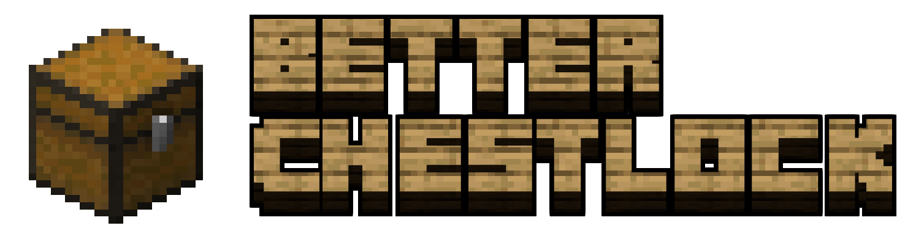
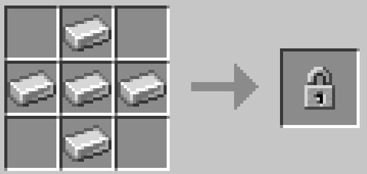
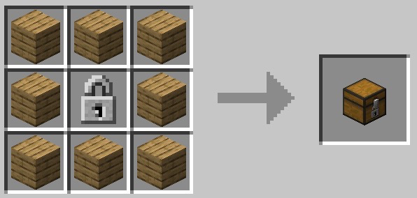

<p align="center">
  
</p>

---

## ✨ Features

- **Owner protection** — the player who places a Locked Chest becomes its owner. Only the owner can *open* and *break* it.
- **Global player trust** — grant a player access to **all** of your chests with a single command.
- **Operator bypass** — OPs can always access every chest (configurable).
- **Hopper / automation protection** — hoppers, hopper minecarts and droppers cannot steal from your chests (configurable).
- **Explosion-proof** — locked chests survive TNT and creepers (configurable).
- **Smart double chests** — chests only merge into a double chest if **both** halves belong to the same owner.
- **Informative feedback** — denied actions show a clear action-bar message.
- **`/chest info`** — inspect any locked chest and see its owner and trusted players.

---

## 🧪 Crafting

### Lock

<p align="center">
  
</p>

### Locked Chest

<p align="center">
  
</p>

---

## ⌨️ Commands

| Command | Description |
| --- | --- |
| `/chest info` | Prepares you to inspect a chest. Right-click any locked chest afterwards to see its owner and trusted players in chat. |
| `/chest trust <player>` | Grants `<player>` access to **all** of your locked chests (open + break). |
| `/chest untrust <player>` | Removes `<player>` from your global trust list. |

> Only the owner can change their own trust list.

---

## ⚙️ Configuration

The config file is created automatically at `config/better-chestlock.json` on the first launch.

```json
{
  "allowHoppers": false,
  "allowExplosions": false,
  "opBypass": true
}
```

| Option | Default | Description |
| --- | --- | --- |
| `allowHoppers` | `false` | If `true`, hoppers, hopper minecarts and droppers can interact with locked chests. |
| `allowExplosions` | `false` | If `true`, explosions (TNT, creepers, …) can destroy locked chests. |
| `opBypass` | `true` | If `true`, operators can always open and break every locked chest. |

---

## 📦 Installation

1. Install the [Fabric Loader](https://fabricmc.net/use/) for **Minecraft 26.3**.
2. Install the [Fabric API](https://www.curseforge.com/minecraft/mc-mods/fabric-api) for the same version.
3. Download the latest `better-chestlock` release and drop it into your `mods` folder.
4. Launch the game.

---

## 🔨 Building from source

Requirements: JDK 25.

```bash
git clone https://github.com/slxca/better-chestlock
cd better-chestlock

# Generate data (loot tables, recipes, translations)
./gradlew runDatagen

# Build the mod jar
./gradlew build
```

The built jar will be at `build/libs/better-chestlock-<version>.jar`.

---

## 📄 License

This project is licensed under the [MIT License](LICENSE.txt). Copyright (c) 2026 slxca.